# 🩸 Raktsetu — Intelligent Emergency Blood Coordination Platform

> **Connecting Verified Blood Requesters with Compatible Nearby Donors in Real-Time.**

[](https://raktsetu-gray.vercel.app/)
[](./PRESENTATION.md)
[](https://react.dev/)
[](https://www.typescriptlang.org/)
[](https://vitejs.dev/)
[](https://tailwindcss.com/)
[](https://supabase.com/)

> 📌 **For Judges & Evaluators:** Please review our slide-by-slide [**Project Presentation & Evaluator Dossier (PRESENTATION.md)**](./PRESENTATION.md) containing the problem statement, clinical motivation, mathematical matching formula, system architecture, and production roadmap.

---

## 🌟 Core Features of Raktsetu

* **🧠 Intelligent RBC Compatibility & Ranking Engine:** Automatically applies certified Red Blood Cell (RBC) biological compatibility rules across all 8 blood groups (`A+`, `A-`, `B+`, `B-`, `AB+`, `AB-`, `O+`, `O-`), generating an overall Match Score (0–100%) computed dynamically from biological compatibility, distance proximity, donor eligibility, and request urgency level.
* **🌐 True Cross-Device Cloud Realtime Synchronization:** Powered by Supabase PostgreSQL and Realtime WebSocket pub/sub channels. Changes triggered on a mobile device immediately update all connected laptops, tablets, and desktops with zero page refreshes.
* **🔄 Two-Way Unified User Capabilities:** Eliminates the rigid boundary between donors and patients. A single account can independently toggle and manage both **Donor Capability** (availability, donation radius, medical eligibility) and **Receiver Capability** (active blood requests, hospital emergency lines) from one unified dashboard.
* **⏱️ Live 5-Stage Synchronized Journey Tracker:** Real-time milestone tracker providing transparent end-to-end visibility:
  $$\text{Request Created} \longrightarrow \text{Donor Accepted} \longrightarrow \text{On The Way} \longrightarrow \text{Reached Receiver} \longrightarrow \text{Donation Completed}$$
* **🔒 Concurrency & Anti-Double-Booking Guard:** When a donor accepts an emergency request, their profile automatically transitions to an active donation lock state, preventing double-acceptance and eliminating wasted trips.
* **🔔 Proactive In-App Push Alert Center:** Immediate notification feed with unread count badges, timestamping, urgency tags (`CRITICAL`, `URGENT`, `NORMAL`), and one-click actions.
* **🛡️ Trust & Safety Layer:** Features self-declared medical checklists (last donation date, minimum weight, chronic conditions), protected password hashes, one-click requester reporting, and donor blocking.

---

## ⚔️ How Raktsetu is Different from Existing Solutions

Traditional emergency blood acquisition is fragmented, chaotic, and heavily reliant on panic-driven social media broadcasts (WhatsApp groups, Twitter/X posts) or outdated manual blood bank registries.

| Feature Dimension | Traditional / Existing Solutions (WhatsApp, Manual Registries) | 🩸 Raktsetu Intelligent Platform |
| :--- | :--- | :--- |
| **Matching Speed & Precision** | ❌ Manual broadcasting; spam messages sent to hundreds of incompatible individuals. | ✅ **Automated Algorithm:** Instant calculation of biological RBC compatibility, geo-radius, and donor availability. |
| **Real-Time Visibility** | ❌ Blind waiting, anxious phone calls, and zero tracking of whether a donor is actually coming. | ✅ **Live Journey Tracker:** Real-time 5-stage milestone tracking synchronized across donor and receiver devices. |
| **Cross-Device Coordination** | ❌ Disconnected apps or isolated local storage; no multi-screen synchronization. | ✅ **Cloud Realtime WebSocket Sync:** Instantly syncs actions across mobile, tablet, and desktop in real-time. |
| **Privacy & Security** | ❌ Sensitive phone numbers and medical details leaked across public groups and social media. | ✅ **Protected Platform:** Masked credentials, secure database RLS policies, and in-app notifications. |
| **Donor Availability & Fatigue** | ❌ Donors get spammed even when they are ineligible, unavailable, or have already donated recently. | ✅ **Smart Availability Controls:** Donors set custom coverage radii, availability toggles, and eligibility cooldown timers. |
| **Double-Booking Prevention** | ❌ Multiple donors show up at the hospital after one already donated, wasting crucial volunteer time. | ✅ **Active Concurrency Lock:** Automatically locks accepted donations to ensure focused 1-to-1 fulfillment. |
| **User Experience** | ❌ Fragmented portals requiring separate accounts for donating vs receiving. | ✅ **Unified Two-Way Portal:** Toggle Donor and Receiver modes seamlessly from a single dashboard. |

---

## 🔬 Live Multi-Device Verification (What We Demonstrated in the Screenshots)

During our end-to-end verification test, we simulated a live emergency scenario between two distinct devices:
- **Device A (Laptop):** Logged in as receiver **`rakesh`** needing **A+ (Critical, 1 Unit)** at Yashoda Hospital.
- **Device B (Mobile):** Logged in as donor **`Tawfiq`** with **O+** blood group and 50 km coverage radius.

Here is how each core feature is demonstrated across the 12 screenshots:

1. **🌐 Cross-Device Real-Time Cloud Sync:** As soon as receiver `rakesh` posted the request on the laptop, donor `Tawfiq`'s mobile screen instantly displayed the incoming request without requiring any page reload. Accepting the request on mobile immediately updated the laptop screen in real time *(Screenshots 3, 4, 8, 12)*.
2. **🧠 Intelligent RBC Blood Compatibility Algorithm:** The system verified that an `O+` donor is biologically compatible for an `A+` recipient, calculated proximity (`< 1 km away`), factored in `CRITICAL` urgency, and awarded a `100% Match Score` *(Screenshots 4, 5, 8, 9)*.
3. **🔄 Two-Way Unified Capabilities:** Demonstrated single-account capability toggles: `rakesh` enabled Receiver mode while keeping Donor mode disabled, and `Tawfiq` enabled Donor mode with customizable radius and eligibility status *(Screenshots 2, 3, 12)*.
4. **⏱️ Live Synchronized Journey Tracker:** As the donation progressed, milestone timestamps (`Request Created: 16:55` ➔ `Donor Accepted: 17:02`) updated in perfect lockstep on both the mobile phone and laptop dashboards *(Screenshots 6, 10)*.
5. **🔔 In-App Real-Time Push Notifications:** Both devices received instant push notifications with unread counter badges and alert details (`Request Accepted · CRITICAL` on donor mobile; `Donor Accepted Your Request` on receiver laptop) *(Screenshots 7, 11)*.
6. **🛡️ Trust & Safety Layer:** Single-donation concurrency locking activated on the donor's dashboard (`Active Donation In Progress`) to prevent double-booking, while the inspection modal provided one-click report and block tools *(Screenshots 2, 5, 6, 9)*.

---

## 📱 Detailed 12-Screenshot Walkthrough

---

### 1. Landing Page & Intelligent Matching Engine
The platform homepage showcasing the live matching engine architecture, compatibility coverage for all 8 blood groups, and quick-action access for donors and requesters.

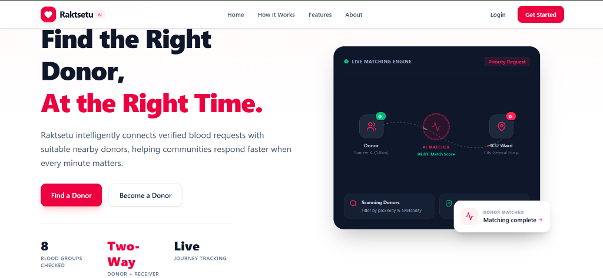

---

### 2. Donor Profile & Capability Setup (Device B — Mobile)
The donor sets up their medical profile with blood group (`O+`), location (`Uttar Pradesh`), donation radius (`50 km`), and eligibility.

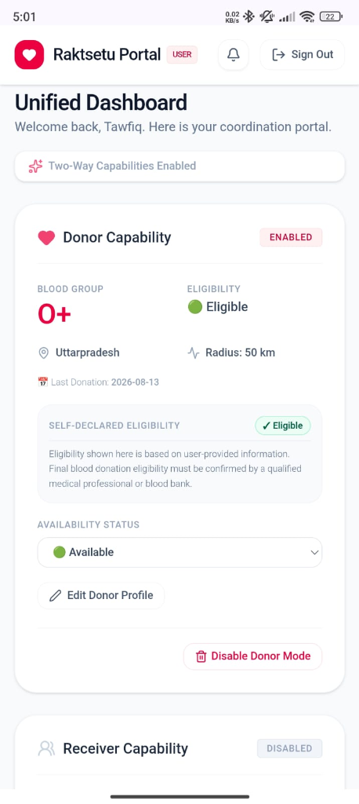

---

### 3. Receiver Emergency Request Creation (Device A — Laptop)
The receiver (`rakesh`) enables Receiver Capability and publishes a Critical `A+` emergency blood request for Yashoda Hospital.

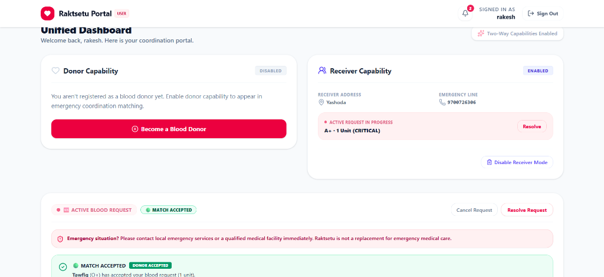

---

### 4. Real-Time Incoming Request Feed (Device B — Mobile)
Within seconds, Device B receives the compatible emergency request with a 100% Match Score and proximity calculation.

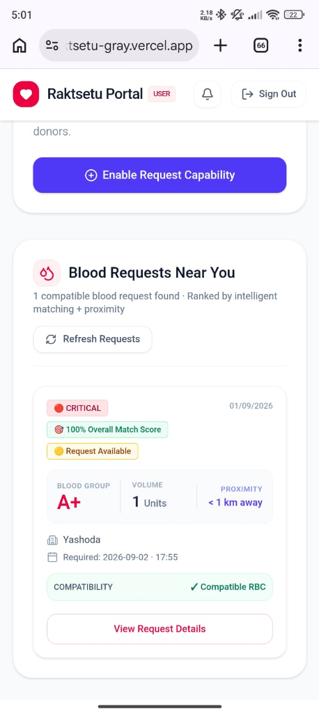

---

### 5. Detailed Compatibility Modal & Action (Device B — Mobile)
The donor opens the request details to verify compatibility factors, hospital location, and deadline before confirming acceptance.

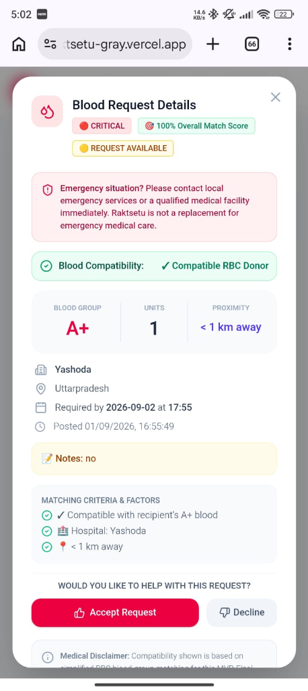

---

### 6. Active Donation State & Live Journey Tracker (Device B — Mobile)
Upon accepting, the donor's dashboard enters the active donation state with real-time progression tracking and milestone logging.

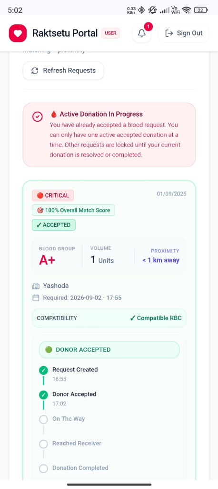

---

### 7. Real-Time Donor Notification Alert (Device B — Mobile)
The donor receives instant confirmation in their notification center.

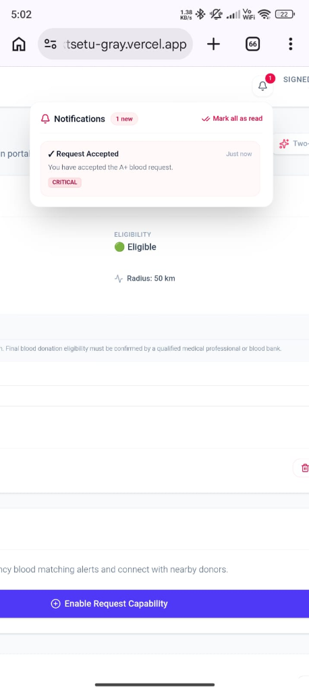

---

### 8. Receiver Dashboard Matched Donor Card (Device A — Laptop)
Instantly on the receiver's laptop, the matching candidate card updates to reflect that donor Tawfiq (`O+`) has accepted.

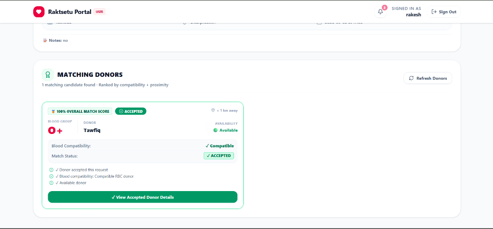

---

### 9. Receiver Matched Donor Profile Modal (Device A — Laptop)
The receiver inspects the full credentials, match breakdown, and verification details of the accepted donor.

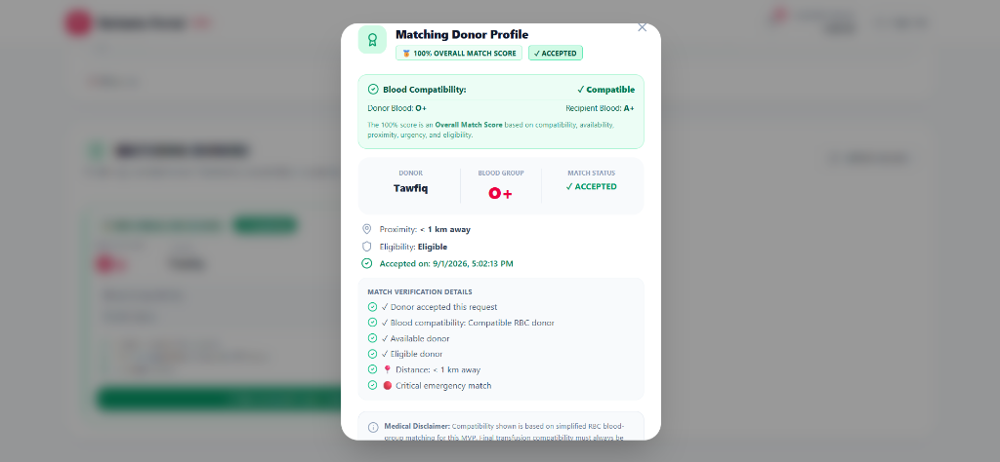

---

### 10. Synchronized Receiver Live Journey Tracker (Device A — Laptop)
Both requester and donor dashboards stay in sync in real-time as the donation progresses through each stage.

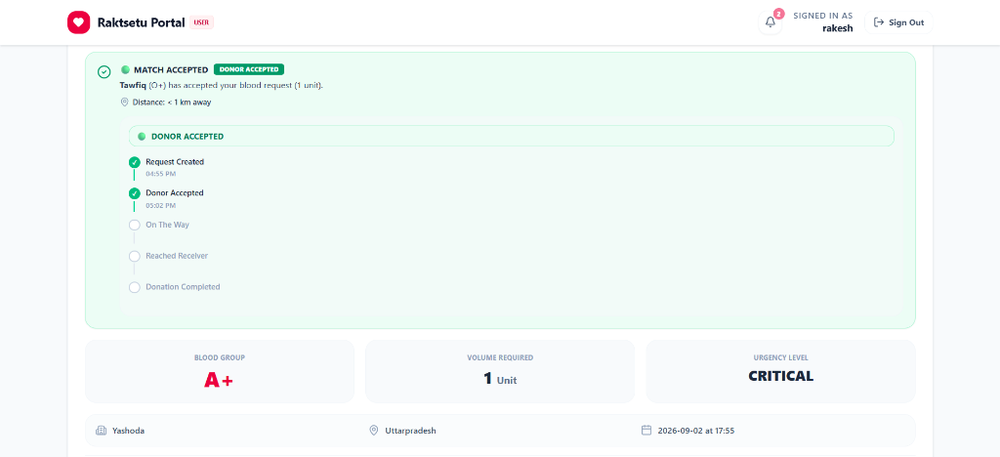

---

### 11. Receiver Real-Time Notification Center (Device A — Laptop)
The receiver receives contextual notifications for all critical match events (`Donor Accepted Your Request`).

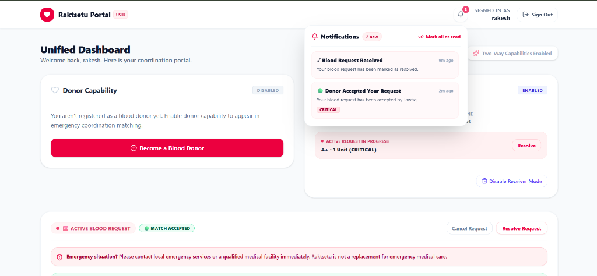

---

### 12. Full End-to-End Dual Device Coordination Overview
High-level overview demonstrating the complete round-trip flow between multiple concurrent users on different devices.

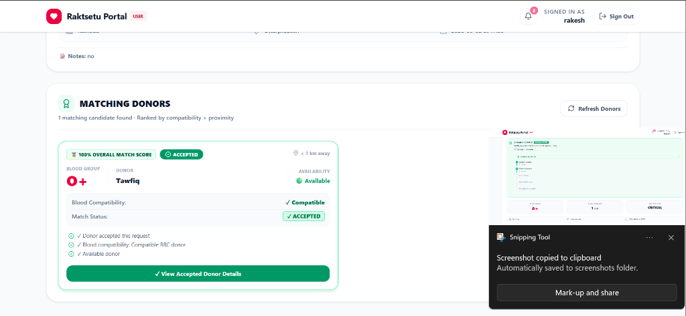

---

## 🏗️ Technical Architecture & Stack

```text
┌────────────────────────────────────────────────────────┐
│                   Raktsetu Frontend                    │
│        React 19 • TypeScript • Vite 8 • Tailwind 4     │
└───────────────────────────┬────────────────────────────┘
                            │
              Dual Layer Database Service
                            │
       ┌────────────────────┴────────────────────┐
       ▼                                         ▼
┌───────────────────────────┐       ┌───────────────────────────┐
│     Supabase Cloud DB     │       │    Local Storage Cache    │
│  PostgreSQL + RLS + Realtime │       │ (Instant offline fallback)│
└───────────────────────────┘       └───────────────────────────┘
```

* **Frontend:** React 19, TypeScript, Vite 8, TailwindCSS 4, Lucide React Icons
* **Cloud Database:** Supabase PostgreSQL with 9 core relational tables:
  - `users` & `users_public` (Secure SHA-256 credentials with protected hash view)
  - `donor_profiles` (Blood group, location, radius, eligibility, availability)
  - `receiver_profiles` (Emergency contact lines, delivery addresses)
  - `hospital_profiles` (Verified healthcare centers)
  - `blood_requests` (Units, urgency level, patient notes, active status)
  - `matches` (Match score, compatibility factors, acceptance status, timestamps)
  - `notifications` (Realtime user alert feed)
  - `user_blocks` & `user_reports` (Trust and safety records)
* **Realtime Communication:** Supabase Realtime Channels (`postgres_changes` websocket listeners) with cross-tab BroadcastChannel fallback.

---

## 🚀 Getting Started Locally

### 1. Clone the repository
```bash
git clone https://github.com/mdsameem9676-web/Raktsetu.git
cd Raktsetu
```

### 2. Install dependencies
```bash
npm install
```

### 3. Configure Environment Variables
Create a `.env.local` file in the root directory:
```env
VITE_SUPABASE_URL=https://your-project-ref.supabase.co
VITE_SUPABASE_ANON_KEY=your-anon-publishable-key
```

### 4. Run the development server
```bash
npm run dev
```

Open [http://localhost:5173](http://localhost:5173) in your browser.

---

## 📄 License
This project is open-source and available under the [MIT License](LICENSE).
